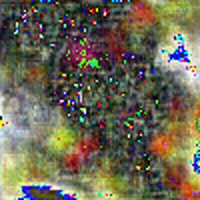

# Abstract Art using GAN
This mini project deals with the generation of abstract art with the aid of General Adversarial Networks or more popularly known as GANs.
GANs are a type of neural networks that can be used for generative machine learning tasks and are able to recreate similar output as that of the input dataset that the neural network is trained upon. 

## What are GANs
This approach consists of two parts, a generator and a discriminator (often called an adversary). The generator creates an image (often a random one, but not truly random) and the adversaries job is to determine whether its real or fake. 
So, basically two neural networks competing against each other. Hence, leading to high usage of computational resources. Also there is no truly accurate method to evaluate the performance. 

## Dataset
Present in the repository itself and the directory access in the code has been kept to be dynamic. Hence, no major changes are required in the code.

## IPython Notebook
Still a work in progress. Adding better documentation of the code.

## External References
Theis article helped me a lot while working on this project ! 
[How to Develop a GAN for Generating MNIST Handwritten Digits](https://machinelearningmastery.com/how-to-develop-a-generative-adversarial-network-for-an-mnist-handwritten-digits-from-scratch-in-keras/)

## Output
Can i really call it abstract art?

    

## Looking for help !!!
Yeah, I'll be more than happy to collaborate on this project. Mainly, I require help with the README.md and the documentation part. Feel free to use this in your semester projects or elsewhere !
